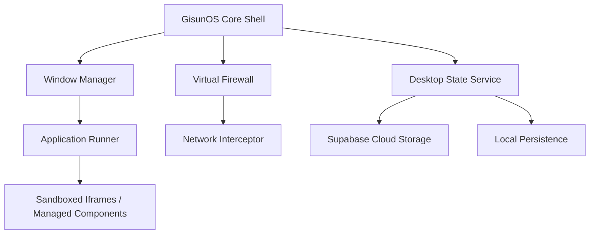

# GisunOS Architecture

GisunOS is built on a modular, web-standard architecture that mimics high-level operating system principles within a single-page application environment.

## High-Level Diagram

## Core Components

### 1. The Core Shell (Kernel Space)
The Shell is the entry point of the system. It handles the initial boot sequence, user authentication, and coordinates between various system services. It maintains the "Global State" which includes open apps, active window focuses, and system notifications.

### 2. Window Manager (WDM)
The WDM is responsible for the visual lifecycle of applications. It handles:
*   **Z-Index Orchestration**: Ensuring the active window is always on top.
*   **Geometric Transitions**: Smooth scaling, dragging, and snapping of windows.
*   **Focus Handling**: Managing keyboard and mouse event routing to the active window.

### 3. Virtual Firewall (VFW)
Unlike traditional web apps that bypass security checks for outbound requests, GisunOS implements a "Virtual Firewall". Every service call or external API request must pass through the VFW module, which:
*   Validates the origin.
*   Enforces user-defined domain policies.
*   Logs outbound traffic for security auditing.

### 4. Application Hub
Applications in GisunOS are treated as independent modules. They communicate with the Core Shell via a standardized **Message Bus API**, allowing them to request system resources (like saving a file or launching another app) without direct access to the global state.

## Tech Stack
*   **Vanilla JS**: Core logic and system services.
*   **CSS3 (Custom Properties)**: Dynamic styling and glassmorphism.
*   **Supabase**: Backend-as-a-Service for files and user data.
*   **Vite**: Build pipeline and development server.

---
*Document Version: 1.0.0*
*Last Updated: 2026-04-19*
